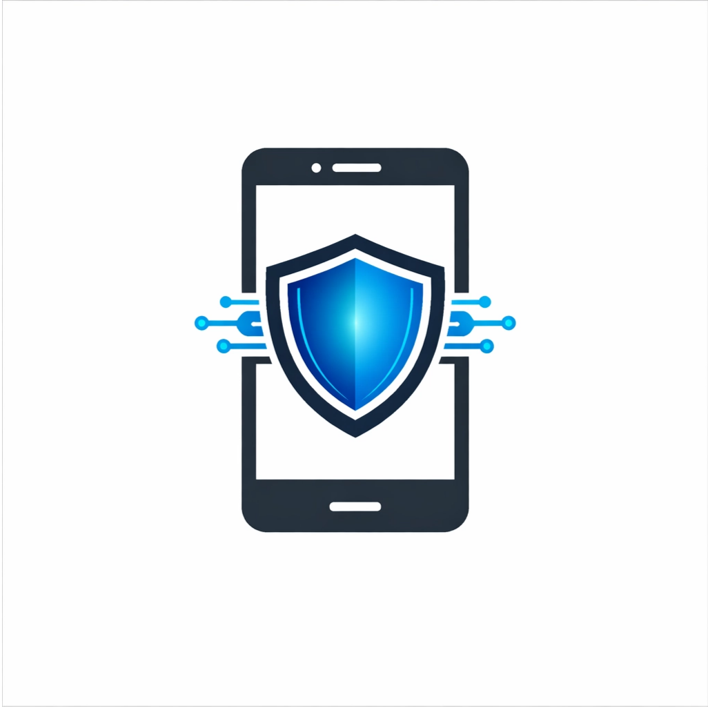

  
  <h1> ResiAll Moni </h1> 

<h1 align="center"> 📑 Descrição Geral  </h1>
<h2>O projeto consiste de uma aplicação de proteção contra furto e acesso sem permissão ao dispositivo móvel, consistindo em um aplicativo no qual o usuário define uma senha de segurança que ira desbloquear a tela, parecendo normal a primeira vista mais com arquivos, dados e aplicativos bloqueados no qual tera alguns aplicativos falso como whatsapp… é quando bloquear a tela novamente ou depois de certo tempo a senha será desativa e podendo só ser reativa pela aplicação que pedira uma senha ao se cadastrar no aplicativo, e quando detectado a utilização de uma das senha sera ativo o processo e bloqueara aquilo que e necessário, e mandara a localização do dispositivo móvel para os contados de emergências definido pelo usuário, só podendo ser desativado pelo aplicativo, pelo próprio dispositivo que foi furtado.  </h2>

## 💻 Funcionalidades:                                                                                                                                                                                                                               Nível de prioridade: O nível das prioridade é definido em 3 nível, Alfa, Beta e ômega. É 3 sub níveis que vai de 1 a 3 sendo a maior prioridade o 1 e o menor o 3. Com esse sistema de prioridade você consegue customizar o que sera salvo no backup primeiro e o que poderá apenas ser escondido, assim como por onde começar a apagar os dados.                                                                                                                                                        Deletar/Esconder: Ao ser ativado o modo segurança dados importantes e pessoal serão ou escondido e deletados dependendo de seu nível de importância e prioridade definida pelo usuário, e dados de nenhum valor a médio baixo serão escondido ao máximo mais não será a prioridade máxima. E os dados com maior prioridade sera apagados primeiros além de serem apagados não sera deixado rastro para engenharia reversa nos dados deletados.                                                      Bloqueio: Quando o modo segurança ativado todos os aplicativos que possua informação importantes como senhas, dados bancários, documentos. Fotos e gravação serão principalmente os primeiros a serem salvos no backup e deletados ou escondidos substituído  por fotos para despistar  suspeita, aplicativos falsos serão disponível. Depois de entrado na tela de bloqueio só poderá ser desativado com a senha principal, quando bloqueada ou sera bloqueado qualquer forma de reformatar, desbloquear com múltiplas tentativas de senhas ou dificultara o máximo possível.                                                                                                                                                                          Backup: Dados de aplicativos, fotos e gravações selecionados pelo usuário, que poderá ser automatizado pelo usuário que sempre sera recomendado, para agilizar no processo de bloqueio. Quando ativado o modo de segurança sera feito automaticamente o Backup de dados de alto nível de importância além dos selecionados, de forma não visível no modo segurança e o salvando para caso precise deles antes de recuperara ou não recuperar o dispositivo.                                    Rastreamento: Envia a localização do dispositivo móvel em tempo real com o máximo de precisão, para contados pre definido pelo usuário do dispositivo. Só permitindo desativar o Rastreamento pelo próprio dispositivo com senha definida na primeira fez logado no aplicativo e o aplicativo ficara bloqueado até a tela de bloqueio ser desbloqueada com a senha principal e normal.                                                                                                                    Modo Teste: No modo teste você consegue ver o processo do Backup, poderá ver o tempo programado para ser bloqueado, sera mandado para você “e para o whatsapp falso” mesmo o rastreamento do dispositivo, mostrar o progresso dos dados de teste sendo deletados e escondido, o usuário poderá ver quais tipos e dados seriam deletados ou escondido. E salvos no backup primeiros com a prioridade configurada.      🔀 Fluxo de funcionamento:
### 1. Configurar o funcionamento do aplicativo
        1. Entrar no aplicativo.
        2. Criar um login para o usuário.
        3. Definir a senha para acessar o aplicativo.
        4. Configurar dados desejados a serem protegidos.
        5. Configurar prioridade dos dados a serem protegidos.
        6. Configurar aplicativos a serem protegidos.
        7. Definir fotos e gravações para despistar suspeita.
        8. Definir senha de teste do modo segurança.
        9. Definir senha para ativar modo segurança.
        10. Definir tempo para bloquear o dispositivo.
        11. Definir quantas vezes poderá ser utilizada a senha antes de desativar.
### 2. Testar o modo segurança.
        1. Desbloquear a tela de bloqueio com senha do teste.
        2. Aparecera uma lista de nome da onde vem os dados e da maior prioridade e menor.
        3. Os dados salvos serão primeiro salvos.
        4. Depois de salvo serão deletado.
        5. Quando deletado ira para o próximo item na lista.
        6. Quanto terminado a lista.
        7. Mostrar os dados do processo de Backup e Deletado.
        8. Depois sera guiado a entrar para ver as fotos e gravações.
        9. Sera guiado a verificar os aplicativos bloqueados. 
        10. Depois de verificado os aplicativos falsos.
        11. Desligue a tela para voltar a tela de bloqueio.
        12. Desbloqueie a tela novamente com a senha de teste.
        13. E assim que for desbloqueado aparecera um time com o tempo escolhido.
        14. Quando o tempo acabar a senha ira parar de funcionar.
        15. Desbloquear com sua senha principal.
        16. Entre no aplicativo com a senha cadastrada.
        17. Mostrara como se reativa a senha escolhida.
        18. Agora pode ajustar a configuração.
### 3. Ativando a aplicação
        1. Teste o modo segurança.
        2. Configure seu contatos de emergências.
        3. Opcional configurar o Backup automática pelo tempo que quiser.
        4. Reative a senha do modo segurança.
        5. Ter certeza de estar com permissão de segundo plano.
#
# 🧑‍💻 Autores                                                                                                                                                                                                                                     Projeto foi desenvolvido para um projeto acadêmico, e pessoal para ganho de experiencia e profissional colocando o conhecimento em  pratica e com ajuda do professor Gilson Ferreira.      <table> <tr> <td align="center"> <a href="#">     <b>Igor Homero</b>  </a> </td> </tr> </table>
